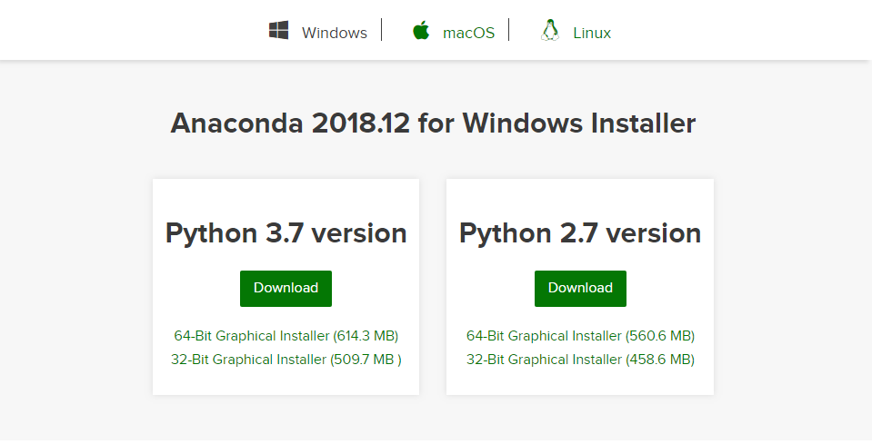
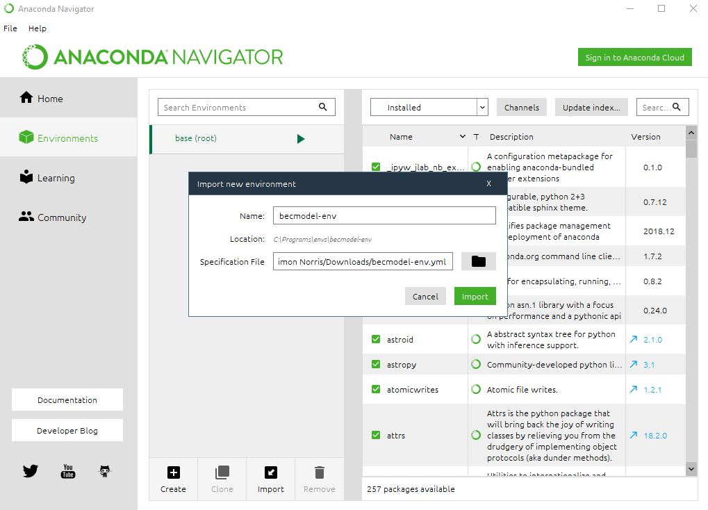
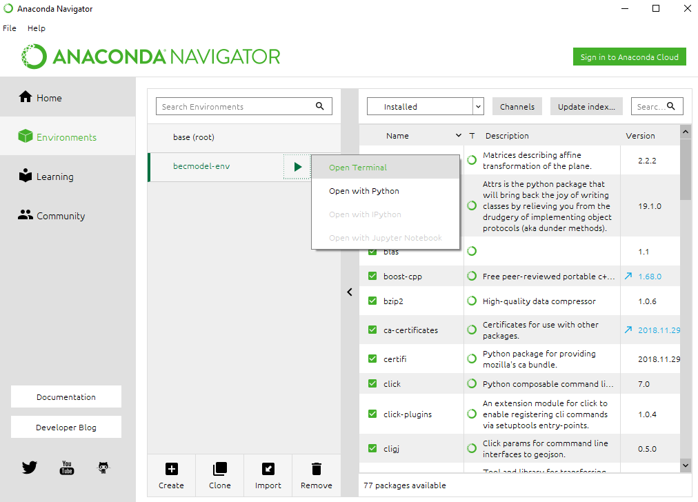
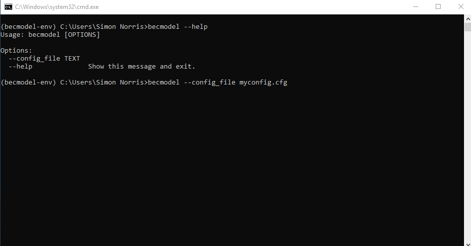

# Installation using Anaconda

1. Download and install [Anaconda](https://www.anaconda.com/distribution/#download-section)

2. Open the Anaconda Navigator from the Start Menu, select the Envronments tab and click the import button in the Environments window. Enter the name of the environment to create (anything) and point to the Specification File provided (`becmodel-env.yaml`):

3. Once the environment is imported (can take some time), click to start the enviroment, selecting `Open Terminal`

4. The `becmodel` command is available at the command prompt terminal. See the [README](../README.md) for a usage guide.

